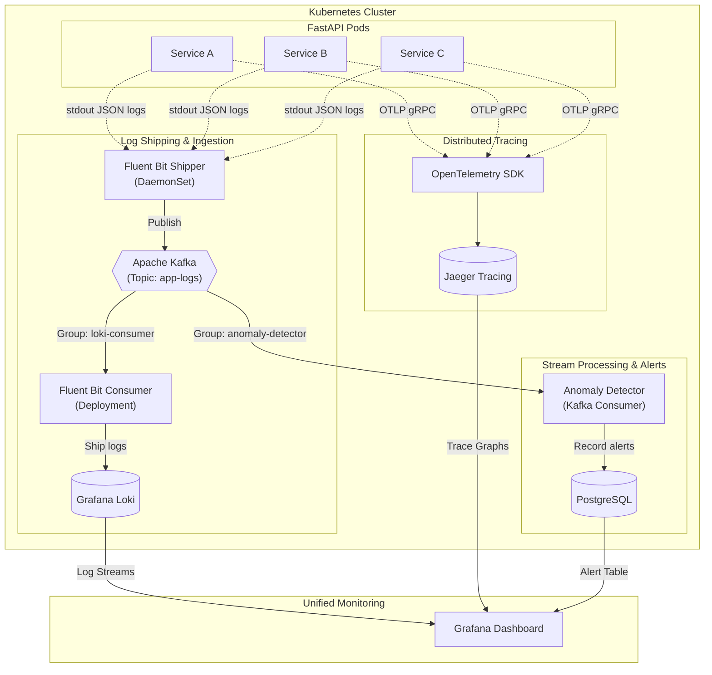

# Microservice Observability Pipeline

A production-grade, distributed microservice telemetry pipeline built with **FastAPI**, **Kubernetes**, **Apache Kafka**, **Fluent Bit**, **Grafana Loki**, **Jaeger**, and **Grafana**. 

Demonstrates end-to-end request correlation, distributed tracing across microservices, streaming log telemetry, real-time anomaly detection, and deterministic failure injection under load.

---

## 🏗️ System Architecture

### 1. HTTP Microservice Request Flow


* **Service A**: API Gateway facing clients. Injects or forwards `X-Request-ID`.
* **Service B**: Business logic coordinator.
* **Service C**: Data access service connected to PostgreSQL via an intentionally tiny connection pool (`DB_POOL_SIZE=3`).

---

### 2. Telemetry & Data Streaming Pipeline



---

## 💡 Why Each Tool?

| Component | Technology | Purpose & Technical Rationale |
| :--- | :--- | :--- |
| **Log Buffer** | **Apache Kafka** | High-throughput broker providing backpressure decoupling. Allows fan-out streaming so multiple consumers (Loki shipper & anomaly detector) ingest logs independently without touching microservice containers. |
| **Log Shipper** | **Fluent Bit** | Lightweight C-based log agent (~few MB RAM vs Logstash's 500MB+). DaemonSet tails pod container logs, enriches with Kubernetes pod metadata, and publishes to Kafka. |
| **Log Storage** | **Grafana Loki** | Index-free log aggregation engine. Indexes metadata labels only, minimizing storage overhead while supporting flexible LogQL filtering by `request_id` or `levelname`. |
| **Distributed Tracing** | **Jaeger & OpenTelemetry** | Standardized OTLP gRPC instrumentation across HTTP calls and SQL queries. Visualizes microservice span graphs and execution latencies. |
| **Single Pane Visualizer** | **Grafana** | Centralized dashboard integrating Loki log streams, PostgreSQL alert tables, log-rate time series metrics, and 1-click derived field links into Jaeger traces. |
| **Deterministic Failure** | **asyncpg (Pool = 3)** | Service C limits database connection pool size to 3. Under load, connection pool contention triggers real `503 Service Unavailable` failures and cascading HTTP timeouts without relying on artificial dice rolls. |

---

## ⚡ Quick Start

### Prerequisites
* Docker Desktop or Minikube
* `kubectl` CLI
* Python 3.10+ (for running load tests locally)

### Option A: Deploy on Kubernetes (Recommended)

```powershell
# 1. Build container images and apply all Kubernetes manifests
.\k8s\deploy.ps1

# 2. Verify rollout status
kubectl get pods,svc
```

Access endpoints:
* **Service A (API Gateway)**: `http://127.0.0.1:30080` (or `kubectl port-forward svc/service-a 8000:8000`)
* **Grafana Dashboard**: [http://127.0.0.1:30300](http://127.0.0.1:30300) (User: `admin` / Password: `admin`)
* **Jaeger UI**: [http://127.0.0.1:31686](http://127.0.0.1:31686)
* **Prometheus**: `http://127.0.0.1:30090` (or `kubectl port-forward svc/prometheus 9090:9090`)
* **Alertmanager**: `http://127.0.0.1:30093` (or `kubectl port-forward svc/alertmanager 9093:9093`)

### Option B: Deploy with Docker Compose

```powershell
# Build and start all services
docker compose up --build -d

# Check health status
docker compose ps
```

> **Note:** Docker Compose does not yet have metrics/alerting support. Use Kubernetes for the full Sprint 2 experience.

---

## 📊 Monitoring, Metrics & Alerting (Sprint 2)

### Prometheus Metrics

All services expose `/metrics` endpoints instrumented with `prometheus-fastapi-instrumentator`:

| Metric | Type | Description |
| :--- | :--- | :--- |
| `http_requests_total` | Counter | Total requests by service, method, status |
| `http_request_duration_seconds` | Histogram | Request latency distribution (p50/p95/p99) |
| `db_pool_active` | Gauge | Service C active DB connections |
| `db_pool_max` | Gauge | Service C max pool capacity |

### RED Dashboards

The Grafana dashboard includes per-service RED panels:
- **Rate**: `sum by (service) (rate(http_requests_total[1m]))`
- **Errors**: `sum by (service) (rate(http_requests_total{status=~"5.."}[1m]))`
- **Duration**: `histogram_quantile(0.95, ...)` p95 latency

### Meta-Monitoring

Prometheus also scrapes the observability infrastructure itself:
- **Kafka Exporter**: Consumer group lag for `loki-consumer` and `anomaly-detector`
- **Fluent Bit**: Buffer/retry rates for shipper and consumer
- **Loki**: `/metrics` endpoint on port 3100
- **Jaeger**: Admin metrics on port 14269

### Alert Rules

| Alert | Condition | Severity |
| :--- | :--- | :--- |
| `HighErrorRate` | >10% 5xx rate for 2 minutes | critical |
| `DBPoolExhausted` | `db_pool_active >= db_pool_max` for 1 minute | critical |
| `KafkaConsumerLagHigh` | Consumer lag >1000 for 5 minutes | warning |

Alerts fire through **Alertmanager** → **Slack** via the `SLACK_WEBHOOK_URL` secret.

---

## 🐕 On-Demand Canary Watchdog & End-to-End Demo Flow

The repository includes an on-demand canary watchdog script ([`scripts/canary_watchdog.py`](file:///c:/Users/krish/OneDrive/Desktop/MyProject/scripts/canary_watchdog.py)) that queries Loki and Jaeger to verify that end-to-end logs and traces are flowing cleanly.

> [!NOTE]
> Always-on scheduling was intentionally descoped for this local development environment, as running an unattended background task on a personal machine introduces unnecessary false alarms and OS-level debugging overhead; in a production deployment, this would run as a lightweight external cron, sidecar, or uptime-check service rather than an OS-level scheduled task.

### Running the Watchdog On-Demand

```powershell
.venv\Scripts\python.exe .\scripts\canary_watchdog.py
```

The script performs a reachability precheck first, queries Loki for recent logs, queries Jaeger for recent traces, and emits a Slack notification if pipeline degradation is detected.

### Recommended Demo Flow (Detect → Alert → Trace)

To demonstrate the full observability and alerting lifecycle in action:

1. **Trigger Load & Faults**: Run the automated Locust load test against the cluster:
   ```powershell
   .\loadtest\full_pipeline_test.ps1
   ```
2. **Observe Real-Time RED Metrics**: Open Grafana at [http://127.0.0.1:30300](http://127.0.0.1:30300) and watch the RED method panels spike as Service C's 3-connection database pool exhausts (`db_pool_active >= db_pool_max`).
3. **Confirm Alertmanager & Slack Notification**: Check Alertmanager at [http://127.0.0.1:30093](http://127.0.0.1:30093) to see `DBPoolExhausted` and `HighErrorRate` alerts trigger and dispatch notifications to Slack.
4. **Inspect Correlated Trace in Jaeger**: From the unified log stream in Grafana, click the `TraceID` link on any failed log line to navigate directly to the Jaeger waterfall trace ([http://127.0.0.1:31686](http://127.0.0.1:31686)) and isolate the root-cause database query timeout.
5. **Verify Telemetry Pipeline**: Run the watchdog script to validate end-to-end telemetry ingestion:
   ```powershell
   .venv\Scripts\python.exe .\scripts\canary_watchdog.py
   ```

---

## 🧪 Scenarios & Failure Injection

Trigger deterministic request behaviors using HTTP headers:

```powershell
# 1. Successful request chain
curl.exe -i -H "X-Request-ID: demo-success-001" -H "X-Demo-Scenario: success" http://127.0.0.1:30080/api/orders/42

# 2. Forced validation error (Service C raises 500 -> B returns 502 -> A returns 502)
curl.exe -i -H "X-Request-ID: demo-error-001" -H "X-Demo-Scenario: error" http://127.0.0.1:30080/api/orders/42

# 3. Cascading timeout (Service C runs pg_sleep(2) -> B times out -> A returns 504)
curl.exe -i -H "X-Request-ID: demo-timeout-001" -H "X-Demo-Scenario: slow" http://127.0.0.1:30080/api/orders/42
```

---

## 🚀 Load Testing (Full Pipeline)

Run Locust against the Kubernetes cluster to trigger database connection pool exhaustion across the entire stack:

```powershell
# Execute automated load test against K8s cluster
.\loadtest\full_pipeline_test.ps1
```

Or execute directly with Locust:

```powershell
pip install -r requirements.txt
cd loadtest
locust -f locustfile.py --headless -u 100 -r 20 --run-time 45s --host http://127.0.0.1:30080
```

### Expected Behavior Under Load
Under 100 concurrent users, Service C's 3-connection database pool exhausts. You will observe:
1. `Service C` emitting JSON logs with `"event": "db_pool_exhausted"`.
2. `Service A` and `Service B` logging downstream HTTP timeout/failure errors.
3. `Anomaly Detector` catching error spikes over sliding 60s windows and writing entries to `anomaly_alerts`.
4. **Alertmanager** firing `HighErrorRate` and `DBPoolExhausted` alerts → Slack notifications.
5. Grafana displaying error spikes, DB pool saturation, and Kafka consumer lag.

---

## 🔍 Failure Tracing Walkthrough

1. Open **Grafana** at [http://127.0.0.1:30300](http://127.0.0.1:30300).
2. Enter a failed request ID (e.g. `demo-timeout-001` or a `loadtest-` ID) into the **Request ID Filter** text box.
3. View the correlated logs across `service-a`, `service-b`, and `service-c` in sequential order.
4. Expand any log entry and click **View Trace in Jaeger** (or **TraceID**).
5. Grafana jumps directly into the matching Jaeger distributed trace, rendering the 4-tier span waterfall: `service-a` -> `service-b` -> `service-c` -> `asyncpg query`.

---

## 📁 Repository Structure

```text
.
├── common/                     # Shared telemetry & database libraries
│   ├── database.py             # asyncpg connection pool, SQL queries & pool metrics
│   ├── logging.py              # Python JSON log formatter with trace context
│   └── tracing.py              # OpenTelemetry OTLP setup
├── services/                   # Microservice applications
│   ├── service_a/              # API Gateway (Port 8000)
│   ├── service_b/              # Orchestrator (Port 8001)
│   ├── service_c/              # Data Access & DB Pool (Port 8002)
│   └── anomaly_detector/       # Kafka Stream Consumer & Anomaly Alerting
├── scripts/                    # Operational scripts
│   └── canary_watchdog.py      # On-demand telemetry pipeline verifier
├── k8s/                        # Kubernetes Manifests (Kustomize)
│   ├── kafka/                  # Kafka broker manifest (KRaft mode)
│   ├── logging/                # Fluent Bit, Loki, & Grafana manifests
│   ├── monitoring/             # Prometheus, Alertmanager, Kafka Exporter, Alert Rules
│   ├── postgres/               # PostgreSQL DB deployment & secrets
│   ├── secrets/                # Secret management (Sealed Secrets / External Secrets)
│   ├── services/               # Microservice deployments & services
│   ├── tracing/                # Jaeger tracing deployment
│   ├── kustomization.yaml      # Master Kustomize file
│   └── deploy.ps1              # K8s build & deployment script
├── loadtest/                   # Load testing tools
│   ├── locustfile.py           # Locust test script with scenario mixing
│   └── full_pipeline_test.ps1  # Automated load test execution script
├── docs/                       # Architecture & operational runbooks
│   ├── ARCHITECTURE.md         # Comprehensive system design & technical trade-offs
│   └── FAILURE_TRACE_RUNBOOK.md# Step-by-step incident investigation guide
├── .github/workflows/          # CI/CD pipelines
│   └── ci.yml                  # Lint → Test → Build → Scan → Push
├── compose.yaml                # Docker Compose multi-container setup
├── requirements.txt            # Python dependencies
└── README.md                   # Project documentation
```

---

## 📚 Documentation & Runbooks

* 📖 **Architecture & System Design**: Read [`docs/ARCHITECTURE.md`](docs/ARCHITECTURE.md) for a comprehensive writeup on the problem statement, technical decisions, and component trade-offs.
* 🛠️ **Failure Tracing Runbook**: Read [`docs/FAILURE_TRACE_RUNBOOK.md`](docs/FAILURE_TRACE_RUNBOOK.md) for step-by-step instructions on diagnosing incidents, examining correlated logs, and inspecting Jaeger traces.

