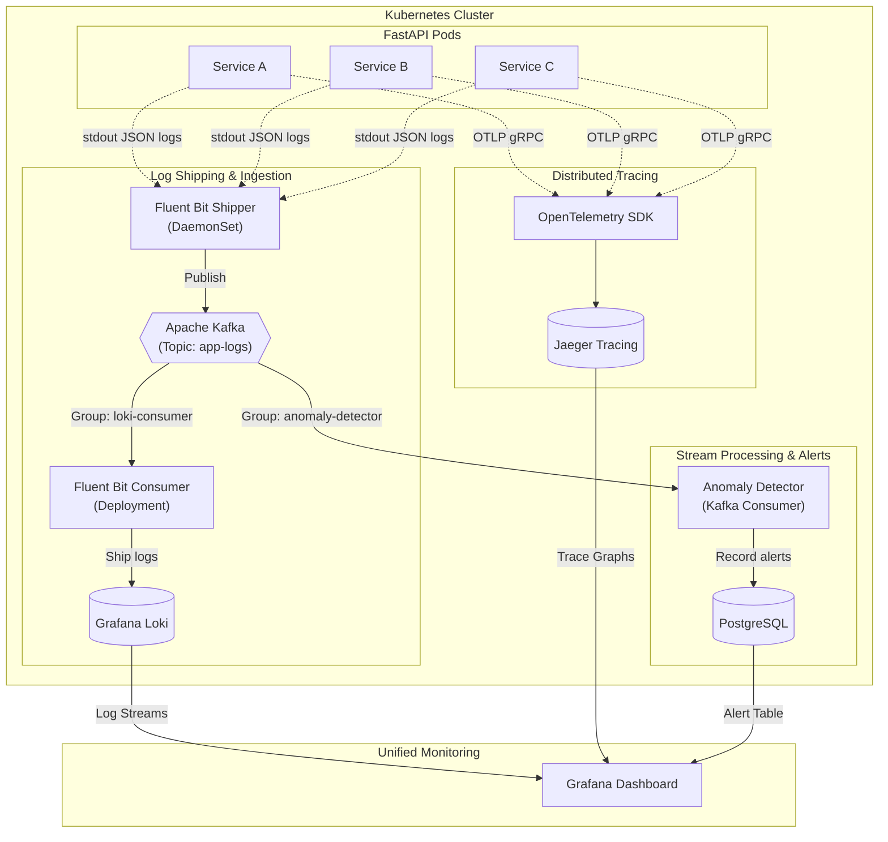

# Microservice Observability Pipeline

A production-grade, distributed microservice telemetry pipeline built with **FastAPI**, **Kubernetes**, **Apache Kafka**, **Fluent Bit**, **Grafana Loki**, **Jaeger**, and **Grafana**. 

Demonstrates end-to-end request correlation, distributed tracing across microservices, streaming log telemetry, real-time anomaly detection, and deterministic failure injection under load.

---

## 🏗️ System Architecture

### 1. HTTP Microservice Request Flow

```mermaid
flowchart LR
    Client([Client / Load Test]) -->|HTTP GET / POST| SA[Service A :8000]
    SA -->|HTTP /internal/orders| SB[Service B :8001]
    SB -->|HTTP /internal/validate| SC[Service C :8002]
    SC -->|asyncpg pool max_size=3| DB[(PostgreSQL)]

    style SA fill:#1f2937,stroke:#3b82f6,stroke-width:2px,color:#fff
    style SB fill:#1f2937,stroke:#3b82f6,stroke-width:2px,color:#fff
    style SC fill:#1f2937,stroke:#ef4444,stroke-width:2px,color:#fff
    style DB fill:#111827,stroke:#10b981,stroke-width:2px,color:#fff
```



* **Service A**: API Gateway facing clients. Injects or forwards `X-Request-ID`.
* **Service B**: Business logic coordinator.
* **Service C**: Data access service connected to PostgreSQL via an intentionally tiny connection pool (`DB_POOL_SIZE=3`).

---

### 2. Telemetry & Data Streaming Pipeline



---

## 💡 Why Each Tool?

| Component | Technology | Purpose & Technical Rationale |
| :--- | :--- | :--- |
| **Log Buffer** | **Apache Kafka** | High-throughput broker providing backpressure decoupling. Allows fan-out streaming so multiple consumers (Loki shipper & anomaly detector) ingest logs independently without touching microservice containers. |
| **Log Shipper** | **Fluent Bit** | Lightweight C-based log agent (~few MB RAM vs Logstash's 500MB+). DaemonSet tails pod container logs, enriches with Kubernetes pod metadata, and publishes to Kafka. |
| **Log Storage** | **Grafana Loki** | Index-free log aggregation engine. Indexes metadata labels only, minimizing storage overhead while supporting flexible LogQL filtering by `request_id` or `levelname`. |
| **Distributed Tracing** | **Jaeger & OpenTelemetry** | Standardized OTLP gRPC instrumentation across HTTP calls and SQL queries. Visualizes microservice span graphs and execution latencies. |
| **Single Pane Visualizer** | **Grafana** | Centralized dashboard integrating Loki log streams, PostgreSQL alert tables, log-rate time series metrics, and 1-click derived field links into Jaeger traces. |
| **Deterministic Failure** | **asyncpg (Pool = 3)** | Service C limits database connection pool size to 3. Under load, connection pool contention triggers real `503 Service Unavailable` failures and cascading HTTP timeouts without relying on artificial dice rolls. |

---

## ⚡ Quick Start

### Prerequisites
* Docker Desktop or Minikube
* `kubectl` CLI
* Python 3.10+ (for running load tests locally)

### Option A: Deploy on Kubernetes (Recommended)

```powershell
# 1. Build container images and apply all Kubernetes manifests
.\k8s\deploy.ps1

# 2. Verify rollout status
kubectl get pods,svc
```

Access endpoints:
* **Service A (API Gateway)**: `http://127.0.0.1:30080` (or `kubectl port-forward svc/service-a 8000:8000`)
* **Grafana Dashboard**: [http://127.0.0.1:30300](http://127.0.0.1:30300) (User: `admin` / Password: `admin`)
* **Jaeger UI**: [http://127.0.0.1:31686](http://127.0.0.1:31686)

### Option B: Deploy with Docker Compose

```powershell
# Build and start all services
docker compose up --build -d

# Check health status
docker compose ps
```

---

## 🧪 Scenarios & Failure Injection

Trigger deterministic request behaviors using HTTP headers:

```powershell
# 1. Successful request chain
curl.exe -i -H "X-Request-ID: demo-success-001" -H "X-Demo-Scenario: success" http://127.0.0.1:30080/api/orders/42

# 2. Forced validation error (Service C raises 500 -> B returns 502 -> A returns 502)
curl.exe -i -H "X-Request-ID: demo-error-001" -H "X-Demo-Scenario: error" http://127.0.0.1:30080/api/orders/42

# 3. Cascading timeout (Service C runs pg_sleep(2) -> B times out -> A returns 504)
curl.exe -i -H "X-Request-ID: demo-timeout-001" -H "X-Demo-Scenario: slow" http://127.0.0.1:30080/api/orders/42
```

---

## 🚀 Load Testing (Full Pipeline)

Run Locust against the Kubernetes cluster to trigger database connection pool exhaustion across the entire stack:

```powershell
# Execute automated load test against K8s cluster
.\loadtest\full_pipeline_test.ps1
```

Or execute directly with Locust:

```powershell
pip install -r requirements.txt
cd loadtest
locust -f locustfile.py --headless -u 100 -r 20 --run-time 45s --host http://127.0.0.1:30080
```

### Expected Behavior Under Load
Under 100 concurrent users, Service C's 3-connection database pool exhausts. You will observe:
1. `Service C` emitting JSON logs with `"event": "db_pool_exhausted"`.
2. `Service A` and `Service B` logging downstream HTTP timeout/failure errors.
3. `Anomaly Detector` catching error spikes over sliding 60s windows and writing entries to `anomaly_alerts`.
4. Grafana displaying error spikes and streaming correlated log flow.

---

## 🔍 Failure Tracing Walkthrough

1. Open **Grafana** at [http://127.0.0.1:30300](http://127.0.0.1:30300).
2. Enter a failed request ID (e.g. `demo-timeout-001` or a `loadtest-` ID) into the **Request ID Filter** text box.
3. View the correlated logs across `service-a`, `service-b`, and `service-c` in sequential order.
4. Expand any log entry and click **View Trace in Jaeger** (or **TraceID**).
5. Grafana jumps directly into the matching Jaeger distributed trace, rendering the 4-tier span waterfall: `service-a` -> `service-b` -> `service-c` -> `asyncpg query`.

---

## 📁 Repository Structure

```text
.
├── common/                     # Shared telemetry & database libraries
│   ├── database.py             # asyncpg connection pool & SQL queries
│   ├── logging.py              # Python JSON log formatter with trace context
│   └── tracing.py              # OpenTelemetry OTLP setup
├── services/                   # Microservice applications
│   ├── service_a/              # API Gateway (Port 8000)
│   ├── service_b/              # Orchestrator (Port 8001)
│   ├── service_c/              # Data Access & DB Pool (Port 8002)
│   └── anomaly_detector/       # Kafka Stream Consumer & Anomaly Alerting
├── k8s/                        # Kubernetes Manifests (Kustomize)
│   ├── kafka/                  # Kafka broker manifest (KRaft mode)
│   ├── logging/                # Fluent Bit, Loki, & Grafana manifests
│   ├── postgres/               # PostgreSQL DB deployment & secrets
│   ├── services/               # Microservice deployments & services
│   ├── tracing/                # Jaeger tracing deployment
│   ├── kustomization.yaml      # Master Kustomize file
│   └── deploy.ps1              # K8s build & deployment script
├── loadtest/                   # Load testing tools
│   ├── locustfile.py           # Locust test script with scenario mixing
│   └── full_pipeline_test.ps1  # Automated load test execution script
├── docs/                       # Architecture & operational runbooks
│   ├── ARCHITECTURE.md         # Comprehensive system design & technical trade-offs
│   └── FAILURE_TRACE_RUNBOOK.md# Step-by-step incident investigation guide
├── compose.yaml                # Docker Compose multi-container setup
├── requirements.txt            # Python dependencies
└── README.md                   # Project documentation
```

---

## 📚 Documentation & Runbooks

* 📖 **Architecture & System Design**: Read [`docs/ARCHITECTURE.md`](file:///c:/Users/krish/OneDrive/Desktop/MyProject/docs/ARCHITECTURE.md) for a comprehensive writeup on the problem statement, technical decisions, and component trade-offs.
* 🛠️ **Failure Tracing Runbook**: Read [`docs/FAILURE_TRACE_RUNBOOK.md`](file:///c:/Users/krish/OneDrive/Desktop/MyProject/docs/FAILURE_TRACE_RUNBOOK.md) for step-by-step instructions on diagnosing incidents, examining correlated logs, and inspecting Jaeger traces.
