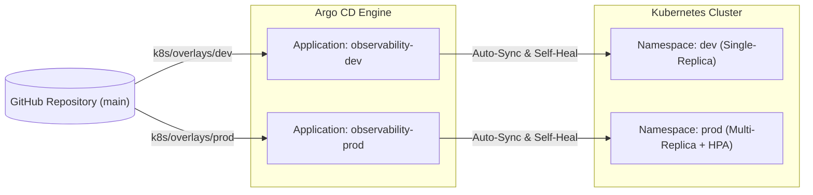

# Microservice Observability Pipeline — Architecture & Design

## Problem Statement

In distributed microservice architectures, a single client transaction traverses multiple services, asynchronous queues, and database connections. When an endpoint experiences degradation, returns `500 Internal Server Error`, or times out with `504 Gateway Timeout`, diagnosing the root cause across distributed infrastructure presents several challenges:

* **Siloed Log Telemetry**: Services emit logs to isolated streams, requiring manual timestamp cross-referencing during incident triage.
* **Missing Context & Trace Correlation**: Standard application logs often lack correlation IDs and distributed trace headers, making it difficult to link downstream database errors to upstream client requests.
* **Passive Log Aggregation**: Without real-time stream evaluation, sudden error spikes or cascading timeouts go unnoticed until alerts fire downstream.
* **Latency Attribution**: Identifying whether latency originates from network roundtrips, service serialization, or database connection contention requires unified distributed tracing.

---

## System Architecture

The platform provides an end-to-end, production-grade microservice observability pipeline running on Kubernetes:

1. **Microservice Call Chain**: Three FastAPI services (`Service A` &rarr; `Service B` &rarr; `Service C` &rarr; `PostgreSQL`).
2. **Structured Log Telemetry**: Every service emits JSON-structured logs containing `request_id`, `service`, `event`, `trace_id`, and `span_id`.
3. **Log Ingestion & Messaging Buffer**: A Fluent Bit DaemonSet (`fluent-bit-shipper`) tails container logs from `/var/log/containers/*.log` and streams them into an Apache Kafka topic (`app-logs`).
4. **Decoupled Processing & Storage**:
   * A Fluent Bit consumer reads from Kafka and ingests logs into **Grafana Loki**.
   * An independent Python stream consumer (`anomaly-detector`) consumes from Kafka using a dedicated consumer group, evaluating error rates over sliding 60-second windows and recording alerts into PostgreSQL.
5. **Distributed Tracing**: OpenTelemetry auto-instrumentation generates distributed traces exported via OTLP/gRPC to **Jaeger**.
6. **Single-Pane Observability**: A pre-configured **Grafana** dashboard correlates logs, metrics, and distributed traces, enabling 1-click drilldown from a Loki log line directly into the matching Jaeger trace.

---

## Technical Design & Component Rationale

| Technology | Role | Technical Justification |
| :--- | :--- | :--- |
| **Apache Kafka** | Log Buffer & Streaming Platform | Provides high-throughput, persistent buffering decoupling log collection from storage. Supports fan-out streaming so multiple consumers (Loki shipper, real-time anomaly detector) process logs independently without impacting core applications. |
| **Fluent Bit** | Log Shipper & Consumer | C-based, low CPU and memory footprint (~few MBs vs JVM log forwarders). Built-in Kubernetes filter parses pod metadata; native Kafka and Loki output plugins handle ingestion cleanly. |
| **Grafana Loki** | Log Aggregation Engine | Index-free log aggregation (indexes metadata labels only, not full log text). Extremely cost-efficient and integrates seamlessly with Grafana and Jaeger derived fields. |
| **Jaeger & OpenTelemetry** | Distributed Tracing | Vendor-neutral OpenTelemetry standards instrument HTTP headers (`X-Request-ID`, W3C trace context) and database queries (`asyncpg`). Jaeger visualizes full request execution graphs and span durations. |
| **Grafana** | Visualization & Correlation | Provides a unified dashboard combining Loki log streams, PostgreSQL alert tables, log-rate time series graphs, and derived field deep-links into Jaeger traces. |
| **asyncpg with Pool Limits** | Deterministic Failure Modeling | Service C uses a fixed pool (`DB_POOL_SIZE=3`). Under concurrent load, connection pool exhaustion causes deterministic HTTP 503 errors and cascading timeouts, proving telemetry reliability under stress. |

---

## Architectural Data Flow

```mermaid
flowchart TD
    subgraph Clients & Ingress
        Client[Client / Locust Load Test]
    end

    subgraph Microservices ["Microservice Cluster (FastAPI + OpenTelemetry)"]
        SA["Service A (:8000)"]
        SB["Service B (:8001)"]
        SC["Service C (:8002)"]
        DB[(PostgreSQL)]

        Client -->|HTTP /api/orders| SA
        SA -->|HTTP /internal/orders| SB
        SB -->|HTTP /internal/validate| SC
        SC -->|asyncpg pool = 3| DB
    end

    subgraph Telemetry ["Telemetry & Data Pipeline"]
        FBS["Fluent Bit Shipper (DaemonSet)"]
        Kafka{{Apache Kafka (Topic: app-logs)}}
        FBC["Fluent Bit Consumer"]
        Loki[(Grafana Loki)]
        Jaeger[(Jaeger Tracing)]
        AD["Anomaly Detector"]

        SA -.->|stdout JSON logs| FBS
        SB -.->|stdout JSON logs| FBS
        SC -.->|stdout JSON logs| FBS

        SA -.->|OTLP gRPC| Jaeger
        SB -.->|OTLP gRPC| Jaeger
        SC -.->|OTLP gRPC| Jaeger

        FBS -->|Stream logs| Kafka
        Kafka -->|Consumer Group: loki| FBC
        Kafka -->|Consumer Group: anomaly-detector| AD
        FBC -->|Ingest logs| Loki
        AD -->|Write alerts| DB
    end

    subgraph Observability ["Unified Visualization"]
        Grafana[Grafana Dashboard]
        Loki -->|Log Streams| Grafana
        Jaeger -->|Trace Graphs| Grafana
        DB -->|Alert Table| Grafana
    end
```

---

## Technical Trade-offs & Scalability Considerations

* **Kafka vs Direct Shipping**: Direct shipping from Fluent Bit to Loki reduces infrastructure overhead. However, placing Kafka in between provides backpressure buffering during traffic spikes, ensuring log producers never drop logs or degrade core application performance.
* **Loki Label Cardinality**: Loki indexes labels only. High-level metadata (`job`, `service`, `levelname`) are used as labels, while variable fields like `request_id` are parsed at query time using Loki's `| json` filter to avoid high-cardinality index bloat.
* **Auto-Instrumentation vs Manual Spans**: OpenTelemetry FastAPI and asyncpg auto-instrumentation capture standard HTTP and database spans automatically with zero invasive code modification. Manual spans are added selectively for custom business logic events.

---

## GitOps Architecture & Continuous Delivery (Argo CD)



* **Declarative Source of Truth**: All configurations live under `k8s/base/` and environment overlays (`k8s/overlays/dev/` and `k8s/overlays/prod/`).
* **Self-Healing & Drift Detection**: Argo CD continuously reconciles cluster state against Git. Any manual tamper or cluster drift is automatically reverted to the Git-declared state.
* **Auto-Scaling**: Service C scales dynamically based on CPU utilization via Kubernetes `HorizontalPodAutoscaler` (HPA).

